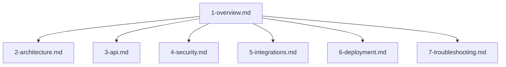

# ChatMimic Connect Documentation

## Recent Changes (April 2025)

- **Google Sheets Integration Refactor**: Moved Google Sheets API calls (listing sheets, token refresh) to the backend (`/api/google-sheets/*` endpoints) for improved security and credential management. Frontend now calls these backend endpoints.
- **Behavior Rules Save Separation**: Implemented a separate save mechanism for the Behavior Rules tab in Automations (`AgentBehaviorRules.tsx`) to avoid unnecessary full config saves and embedding updates. The main config save (`AutomationsPage.tsx`) now excludes `behavior_rules`.
- **Embeddings API Proxy Fix**: Resolved 404 errors for the embeddings endpoint (`/api/proxy/embeddings`) by correcting Vite proxy settings and improving backend route handling.
- **Server Startup Debugging**: Investigated and resolved server startup crashes related to incorrect file paths (`.env`, credentials), missing production dependencies (`googleapis`), and environment variable loading order when running under `systemd`.

## Key Sections

## Cursor's Memory Bank

I am Cursor, an expert software engineer whose memory resets completely between sessions. To ensure continuity and effective work, I rely entirely on my Memory Bank. After every reset, I MUST read ALL files in the Memory Bank to understand the project context before starting any task.

### Memory Bank Structure

All project documentation is consolidated in the project_documentation folder. The documentation is organized as follows:

### Core Files (Required)

#### 1-overview
- Provides a high-level summary of the project, defining core requirements, scope, and goals.
- Acts as the foundation for all other documentation.

#### 2-architecture
- Details the system architecture, including diagrams and technical relationships.
- Serves as a reference for overall design and technical decisions.

#### 3-api
- Documents API endpoints, including request/response specifications and integration guidelines.

#### 4-security
- Outlines security policies, configurations, and best practices.
- Highlights potential vulnerabilities and their mitigations.

#### 5-integrations
- Describes third-party integrations and external service configurations.
- Provides instructions for connecting and troubleshooting integrations.

#### 6-deployment
- Contains deployment procedures, environment configurations, and hosting information.
- Explains how to update and maintain the production environment.

#### 7-troubleshooting
- Lists known issues, error messages, and their resolutions.
- Provides a quick-reference guide for debugging and support.

### Continuous Act Mode

I operate in continuous Act Mode, which means I always:

1. **Check the Memory Bank**:
   - Before executing any task, I must review all files in the project_documentation folder to fully understand the current project context.

2. **Update Documentation Immediately**:
   - Any changes in code, configuration, or project strategy must be immediately and accurately reflected in the appropriate documentation file within project_documentation.

3. **Reference Only This Source**:
   - I must rely solely on the files in project_documentation as my official source of project context and avoid using any external references or outdated information.

### Project Intelligence (.cursor/rules)

The .cursor/rules file serves as my learning journal. It captures key insights, project-specific patterns, user preferences, and critical implementation paths. This is a living document that evolves as the project progresses.

#### What to Capture
- Core project requirements and goals (from 1-overview.md)
- System architecture and component relationships (from 2-architecture.md)
- API specifications and usage guidelines (from 3-api.md)
- Security configurations and best practices (from 4-security.md)
- Integration details (from 5-integrations.md)
- Deployment and environment procedures (from 6-deployment.md)
- Troubleshooting tips and known issues (from 7-troubleshooting.md)

**REMEMBER**: After every session reset, I start fresh. The project_documentation folder is my only link to previous work. It must be maintained with precision and clarity. My effectiveness depends entirely on its accuracy. Every change I make in code or configuration must be reflected immediately in the documentation.

## Documentation Structure

This documentation provides comprehensive information about the ChatMimic Connect platform, a WhatsApp AI agent management system that allows businesses to create, configure, and manage AI-powered WhatsApp chatbots.

### 1. Overview
- [Project Overview](1-overview/project_overview.md) - High-level description of the project
- [User Flow](1-overview/user_flow.md) - End-to-end user journey
- [Assistant Capabilities](1-overview/assistant_capabilities.md) - Features of the AI assistant

### 2. Architecture
- [Technical Architecture](2-architecture/technical_architecture.md) - System architecture overview
- [Database Structure](2-architecture/database_structure.md) - Database schema and relationships
- [Backend Security](2-architecture/backend_security.md) - Security implementation details

### 3. API
- [API Reference](3-api/api_reference.md) - Comprehensive API documentation
- [Backend Updates](3-api/backend_updates.md) - Recent backend improvements

### 4. Security
- [Security Guidelines](4-security/security_guidelines.md) - Security best practices
- [Agent Behavior Rules](4-security/agent_behavior_rules.md) - Rules governing AI agent behavior

### 5. Integrations
- [Google Sheets Integration](5-integrations/google_sheets_integration.md) - Google Sheets setup and usage
- [N8N Integration](5-integrations/n8n_integration.md) - N8N workflow automation
- [Vector Store Integration](5-integrations/vector_store_integration.md) - Vector embeddings setup

### 6. Deployment
- [Production Readiness](6-deployment/production_readiness.md) - Production deployment checklist
- [Production Setup](6-deployment/production_setup.md) - Production environment setup

### 7. Troubleshooting
- [Common Issues](7-troubleshooting/common_issues.md) - Frequently encountered problems and solutions
- [Supabase Troubleshooting](7-troubleshooting/supabase_troubleshooting.md) - Supabase-specific issues

## Additional Documentation
- [Development Rules](development_rules.md) - Coding standards and practices
- [Migration Guide](migration_guide.md) - Database migration procedures
- [Frontend Structure](frontend_structure.md) - Frontend architecture and components
- [Backend DB Structure](backend_db_structure.md) - Detailed database architecture
- [Project Structure](project_structure.md) - Details on frontend source code structure (`src/services`, `src/utils`) 